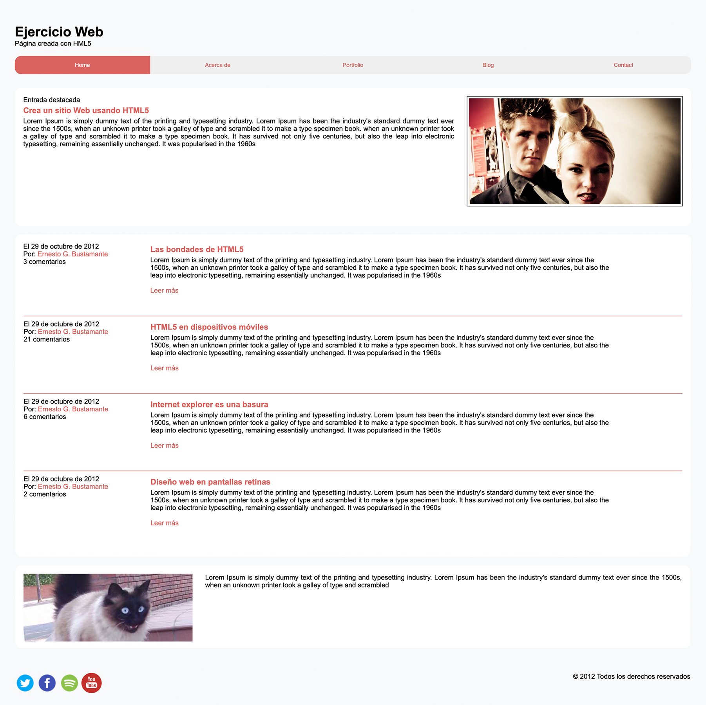

# Website

### About this repository
This repository can be used as a template for a simple website 
Made in HTML and CSS

### Contributing
Thank you for considering contributing to the R-Art-project.

### License
It's open-sourced software licensed under the [MIT license](https://opensource.org/licenses/MIT).

##### Made with 💚 in "Platzi Master" (https://platzi.com)
 

